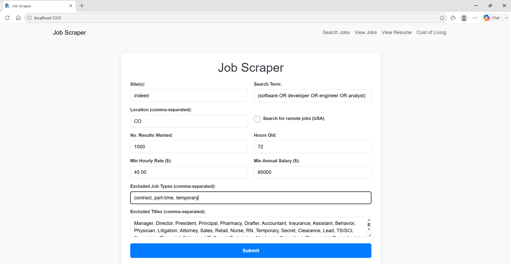
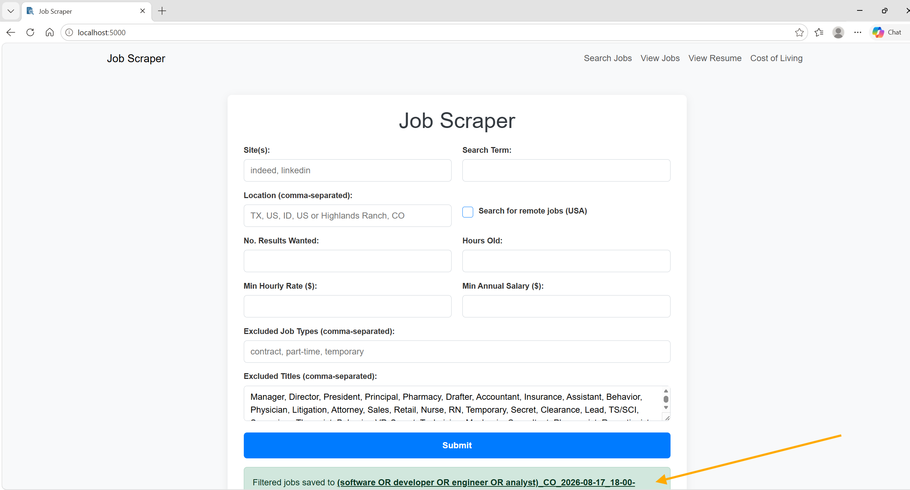
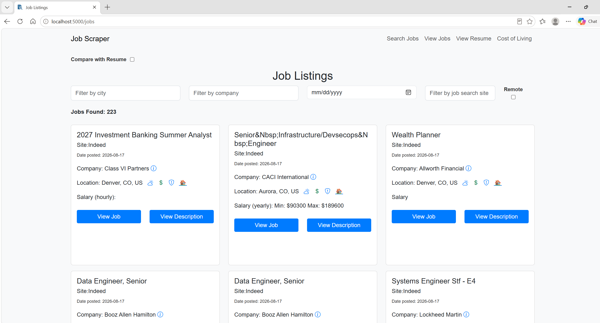
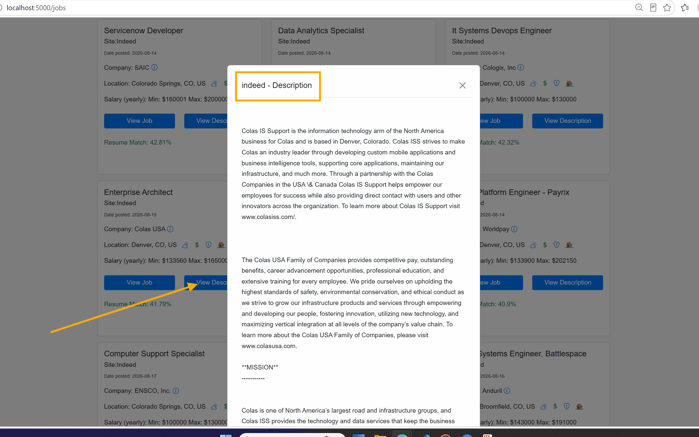
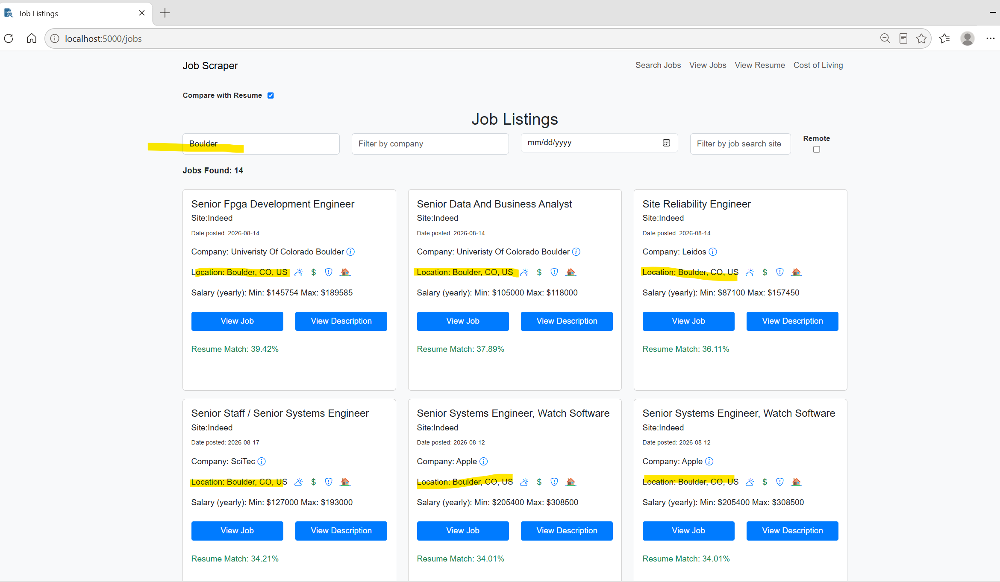
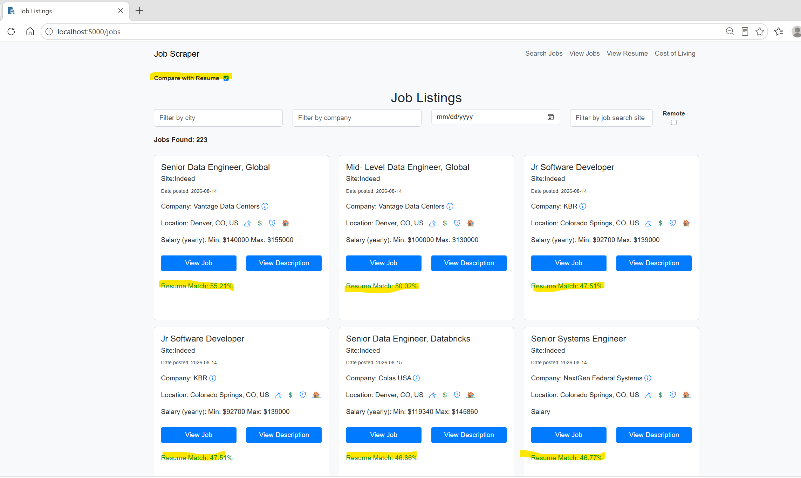
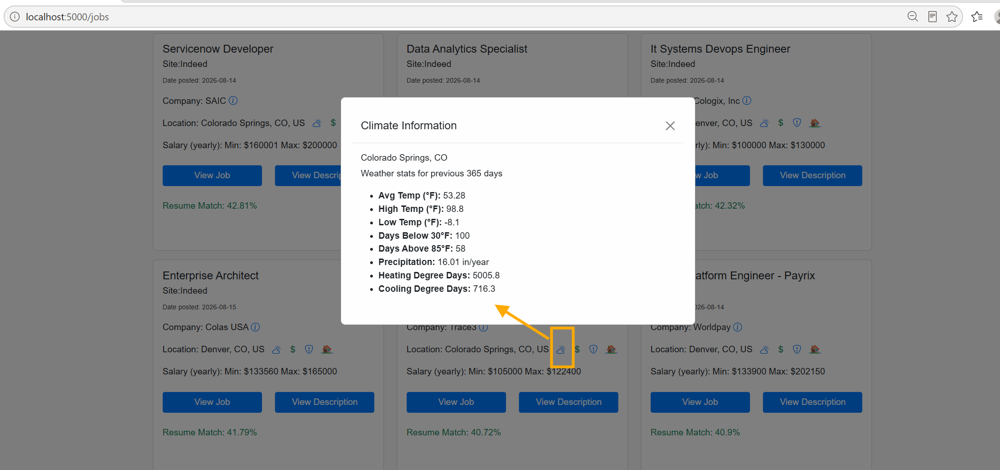
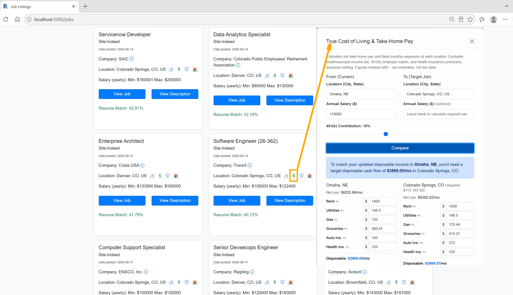

# Job Scraper

A Flask web app that fetches and filters job postings from multiple boards (Indeed, LinkedIn) using [python-jobspy](https://github.com/speedyapply/JobSpy).

Note: No proxy is used, so results are best on Indeed and LinkedIn. Glassdoor and Zip Recruiter are also accepted by the search form, but without a proxy they're more likely to be rate-limited or blocked.

## Prerequisites

- [Docker Desktop](https://www.docker.com/get-started/) installed and running.
- (Optional, for Cost of Living features) API keys for the services listed in `.env.example`.

## Installation

1. Clone the repo and `cd` into it.
2. Copy the environment template and fill in your own keys:

   ```bash
   cp .env.example .env
   ```

   The Cost of Living comparison feature uses these free/low-cost APIs — the app runs fine without them, but those calculations will be skipped:

   - [API Ninjas](https://api-ninjas.com/) — `API_NINJAS_KEY`
   - [OpenEI](https://openei.org/services/) — `OPENEI_API_KEY`
   - [EIA](https://www.eia.gov/opendata/register.php) — `EIA_API_KEY`
   - [HUD FMR API](https://www.huduser.gov/portal/dataset/fmr-api.html) — `HUD_FMR_API_TOKEN`
   - [BEA](https://apps.bea.gov/API/signup/) — `BEA_API_KEY`

   `.env` is gitignored — never commit it.

## Project Layout

```tree
  .dockerignore
│   ATTRIBUTION.md
│   docker-compose.yml
│   Dockerfile
│   LICENSE.md
│   patch_glassdoor.py
│   pyproject.toml
│   README.md
│   .env.example
│   
├───images
│       BoulderFilter.PNG
│       CompareResume.PNG
│       JobScraperForm.PNG
│       SearchCompleted.PNG
│       ViewDescription.png
│       ViewJobs.PNG
│       
└───job_scraper_app
    │   app.py
    │   CommonExclusions.txt
    │   job_scraper.py
    |   col_cache.db
    |   check_state_tax_freshness.py
    │   
    ├───files
    ├───resume
    ├───static
    │       favicon.ico
    │       jobs.js
    │       main.js
    │       resume.js
    │       spinner.gif
    │       style.css
    │       
    ├───templates
    │       index.html
    │       jobs.html
    │       resume_display.html
    │       
    ├───utils
    │   │   climate_utils.py
    │   │   col_cache.py
    │   │   col_utils.py
    │   │   download_nltk_data.py
    │   │   file_utils.py
    │   │   input_utils.py
    │   │   resume_utils.py
    │   │   transformations.py
    │   │   state_auto_insurance_2026.json
    │   │   state_tax_2026.json
    │   │   __init__.py
```

## Running the App

```bash
docker compose up --build
```

Then open [http://localhost:5000](http://localhost:5000) in your browser.

On subsequent runs you can drop `--build` unless you've changed `pyproject.toml`:

```bash
docker compose up
```

To stop:

```bash
docker compose down
```

## Using the Web Interface

Fill in the search form to specify:

- **Job title / search term** and **location(s)** (comma-separated for multiple)
- **Job boards** to scrape (`indeed`, `linkedin`, `glassdoor`, `zip_recruiter`)
- **Exclusions** — job types or title keywords to filter out (defaults loaded from `CommonExclusions.txt`)
- **Minimum pay** — optional hourly or annual floor
- **Results wanted** and **hours old** to control result volume and freshness

After submitting, a CSV download link appears and the **View Jobs** page shows a filterable card view of the results.

### View Jobs features

- Filter cards by city, company, date, or job board (prefix with `-` to exclude)
- **View Description** opens the full job description in a modal
- **Company info** icon shows the board's company page
- **Weather / crime / apartments** icons pull live location data for each city
- **Compare with Resume** — upload a `.txt`, `.pdf`, or `.docx` resume and the app scores and re-sorts every job card by match percentage

### Cost of Living

- The **Cost of Living** nav link opens the ERI Cost of Living Comparison site so you can compare cities against a target salary.
- The $ icon within the job card now runs local modules to compute a comparable salary using data regarding taxes, healthcare, insurance, utilities, rents, and food for a "from" city to the "target" city.

## Data persistence

Uploaded resumes and generated CSV files are stored in Docker named volumes (`resume_data`, `output_data`) and survive container restarts.

## Screenshots

| | |
| --- | --- |
| **Search form** | **Results** |
|  |  |
| **View Jobs** | **Job Description** |
|  |  |
| **Filter content (-Boulder excludes from list)** | **Rank results for Resume** |
|  |  |
| **Cloud icon - displays climate data** | **$ Compare Cost of Living between cities** |
|  |  |
